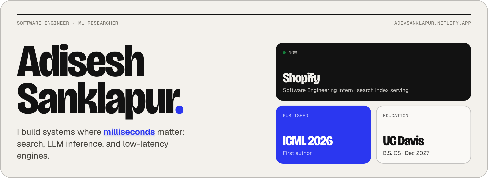
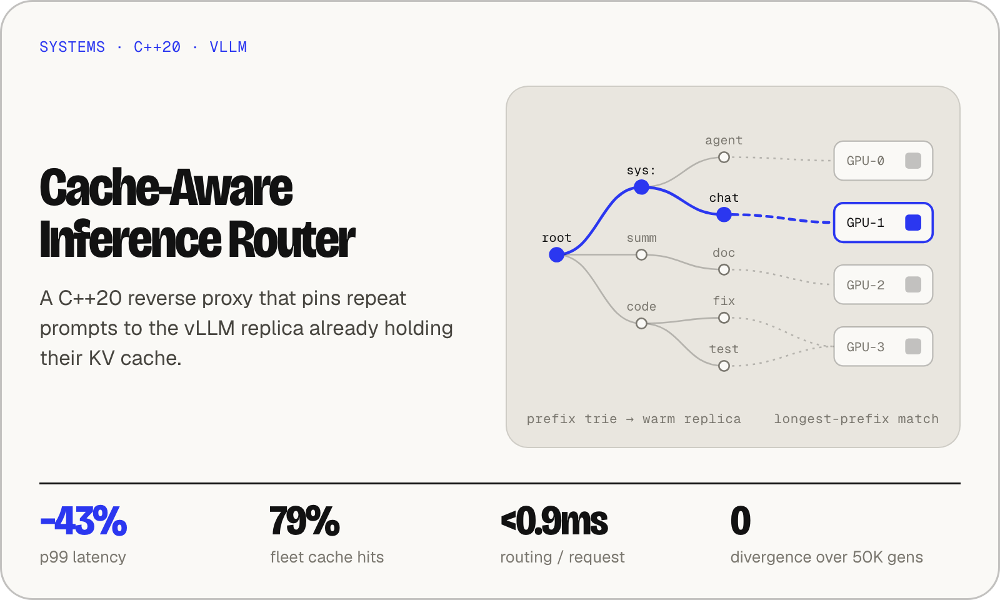
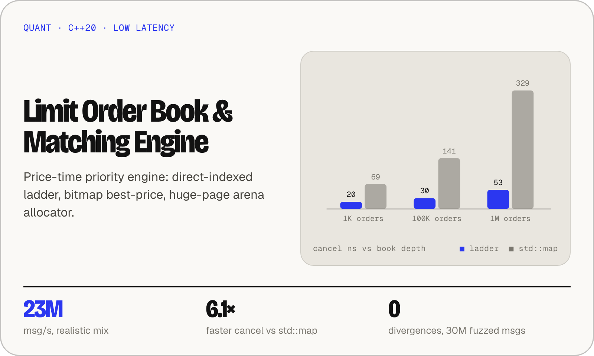
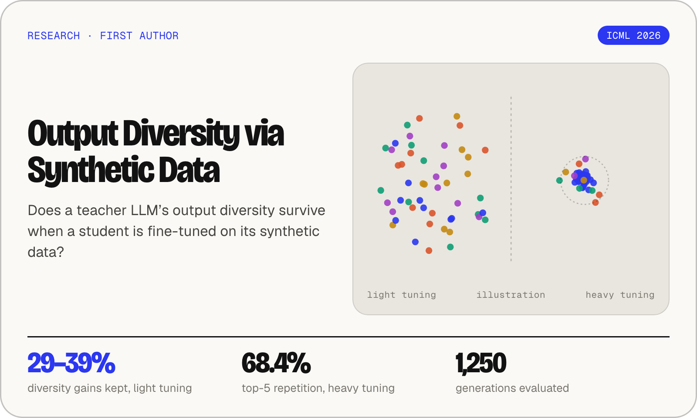
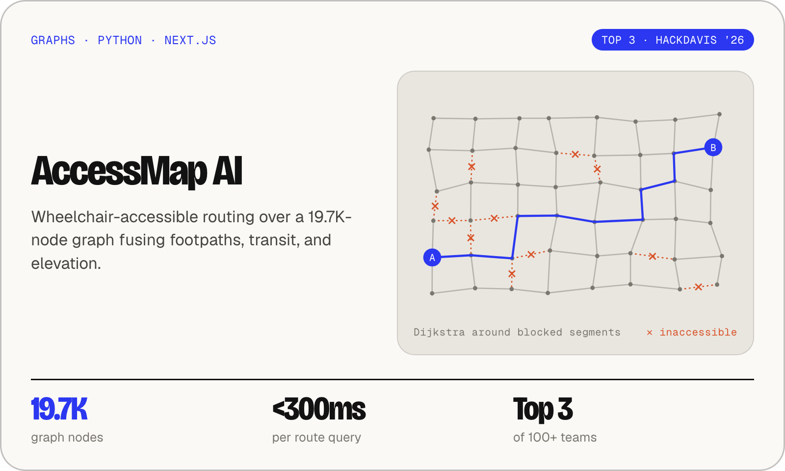
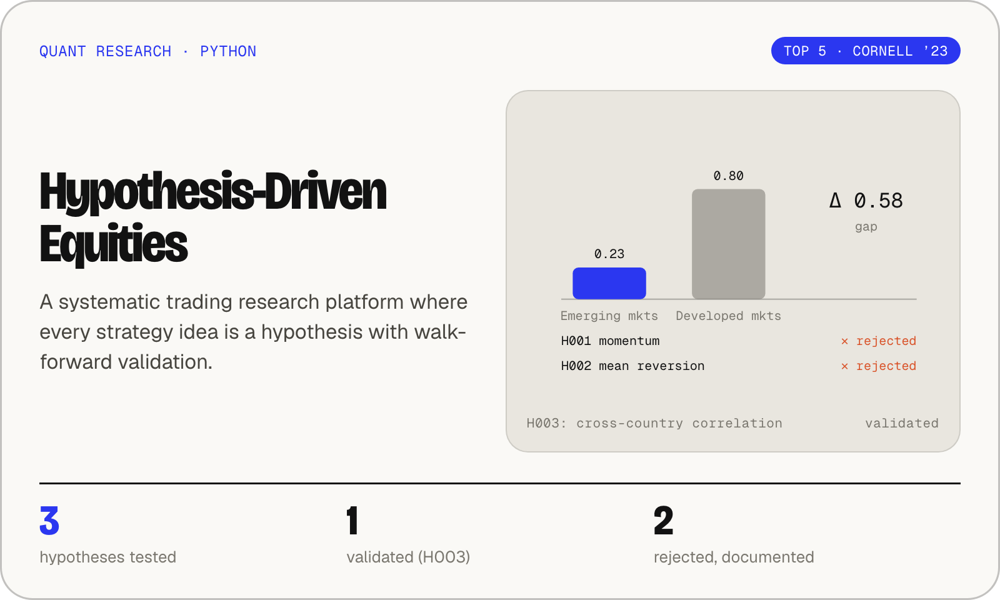
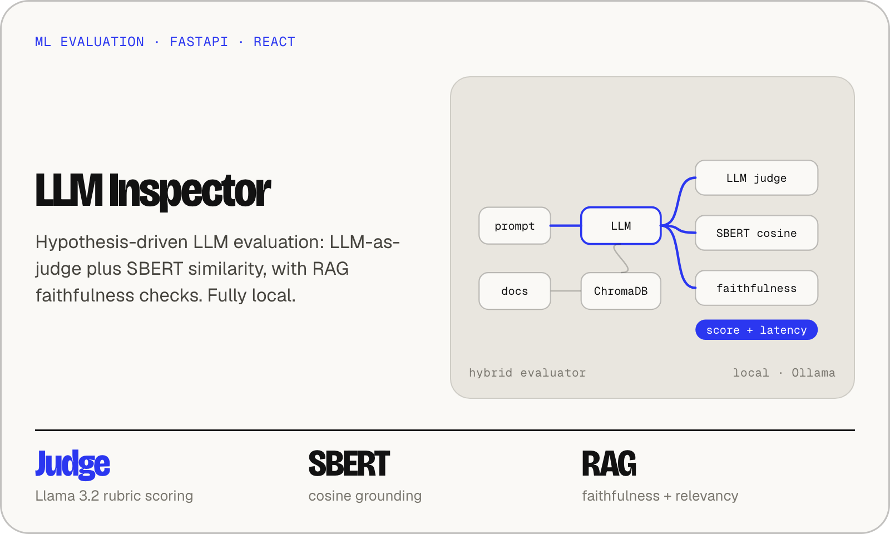

<a href="https://adivsanklapur.netlify.app/">
  <picture>
    <source media="(prefers-color-scheme: dark)" srcset="./assets/banner-dark.png" />
    
  </picture>
</a>

  <a href="https://adivsanklapur.netlify.app/"><b>Portfolio</b></a> &nbsp;·&nbsp;
  <a href="https://www.linkedin.com/in/adivsanklapur/"><b>LinkedIn</b></a> &nbsp;·&nbsp;
  <a href="mailto:adivenkatesh@ucdavis.edu"><b>Email</b></a>

### Featured work

<table>
  <tr>
    <td width="50%">
      <a href="https://github.com/adiseshvsanklapur/cache-aware-inference-router">
        <picture>
          <source media="(prefers-color-scheme: dark)" srcset="./assets/router-dark.png" />
          
        </picture>
      </a>
    </td>
    <td width="50%">
      <a href="https://github.com/adiseshvsanklapur/High-Performance-LOB">
        <picture>
          <source media="(prefers-color-scheme: dark)" srcset="./assets/lob-dark.png" />
          
        </picture>
      </a>
    </td>
  </tr>
  <tr>
    <td width="50%">
      <a href="https://genaicreativity.org/icml2026/files/67/67_paper.pdf">
        <picture>
          <source media="(prefers-color-scheme: dark)" srcset="./assets/icml-dark.png" />
          
        </picture>
      </a>
    </td>
    <td width="50%">
      <a href="https://github.com/adiseshvsanklapur/AccessMapAI">
        <picture>
          <source media="(prefers-color-scheme: dark)" srcset="./assets/accessmap-dark.png" />
          
        </picture>
      </a>
    </td>
  </tr>
  <tr>
    <td width="50%">
      <a href="https://github.com/adiseshvsanklapur/Hypothesis-Driven-Equities">
        <picture>
          <source media="(prefers-color-scheme: dark)" srcset="./assets/equities-dark.png" />
          
        </picture>
      </a>
    </td>
    <td width="50%">
      <a href="https://github.com/adiseshvsanklapur/LLM-Inspector">
        <picture>
          <source media="(prefers-color-scheme: dark)" srcset="./assets/inspector-dark.png" />
          
        </picture>
      </a>
    </td>
  </tr>
</table>

### Experience

- **Shopify**: Software Engineering Intern, search index serving
- **ARMS Lab, UC Davis**: AI Systems Researcher
- **Pinpoint, Codelab Davis**: Software Developer
- **Arcadia**: Software Engineering Intern, robotics

### Toolkit

**Languages** &nbsp;C++17/20 · Python · SQL · TypeScript · Go · Java · C# 
**Systems & ML** &nbsp;vLLM · PyTorch · LoRA/PEFT · MLX · FastAPI · PostgreSQL · Redis · Kafka 
**Infra** &nbsp;Docker · Kubernetes · AWS · GCP · Linux · CI/CD
